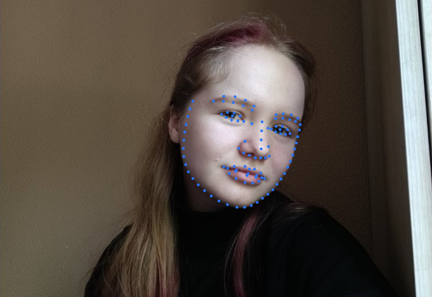
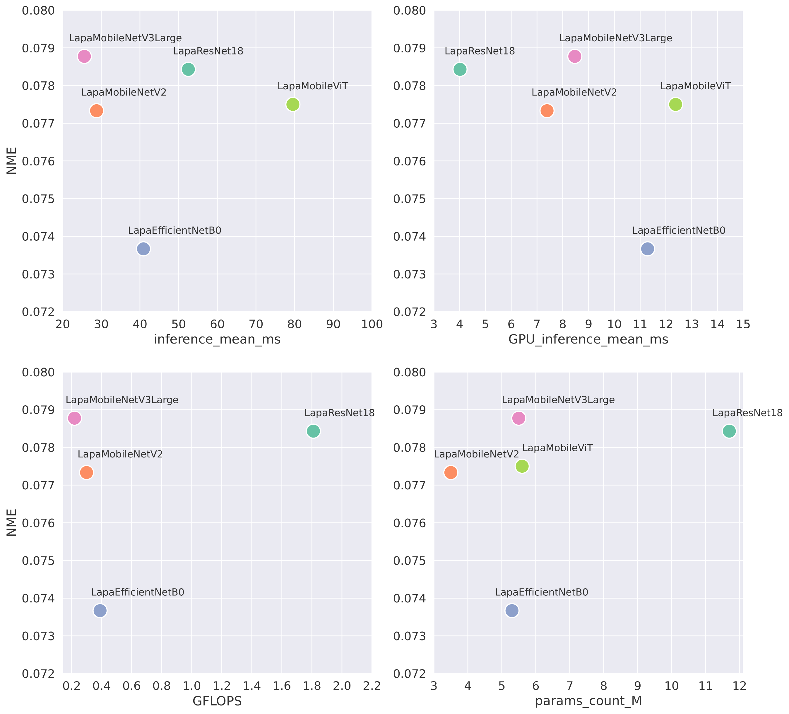
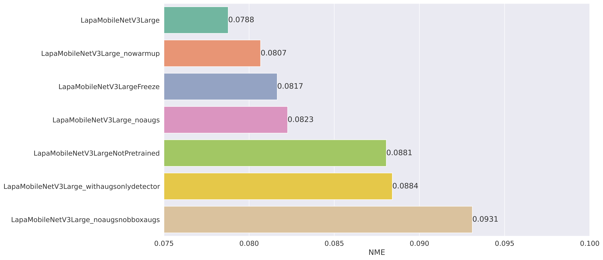
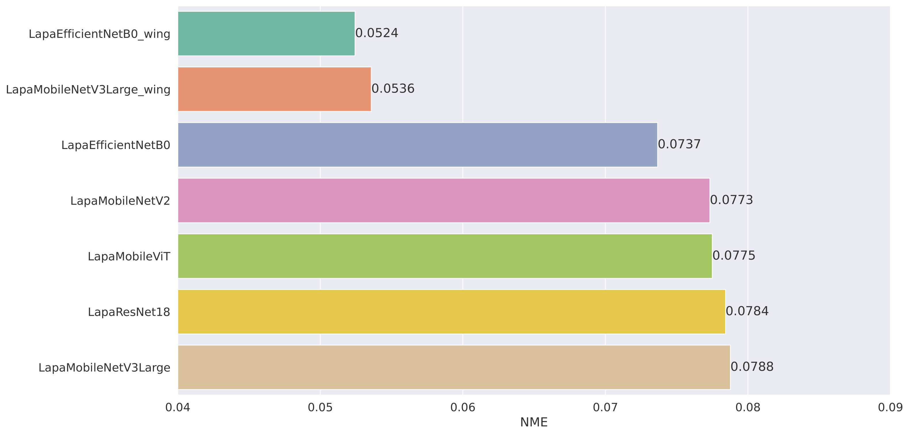

# Face Landmarks Detection

This project was done in terms of __The 80th University Scientific Conference of Students and Postgraduates__. The text in Russian is available [here](papers/conference.pdf). There is also a more detailed version of this text [here](papers/full_version.pdf). 

Source jupyter notebook in English with main aspects of the project is available [here](./src.ipynb).

The example of landmarks detection on the video can be found [here](images/face_video_example_processed.mp4).

## Short summary

The main aim of the project was to compare different neural networks architectures (__ResNet18, MobileNetV2, EfficientNetB0, MobileNetV3-Large, MobileViT-Small__) and the influence of various aspects in the training process on the task of regression of 2D facial landmarks. The [LaPa](https://github.com/JDAI-CV/lapa-dataset) dataset was used to train the networks and estimate the quality of the results.

On the next plot you can see the dependence of the NME (normalized mean error) on the test part of the dataset from various parameters: the inference time on the CPU, on the GPU, GFLOPS, the number of trained parameters:

The influence and importance of various aspects in the training process and data preparation was analyzed on the base of MobileNetV3:

The amazing quality improvement was reached after replacing the MSE loss with the Wing loss:

The example of landmarks detection on the video with the EfficientNetB0 and the Wing loss can be found [here](images/face_video_example_processed.mp4).